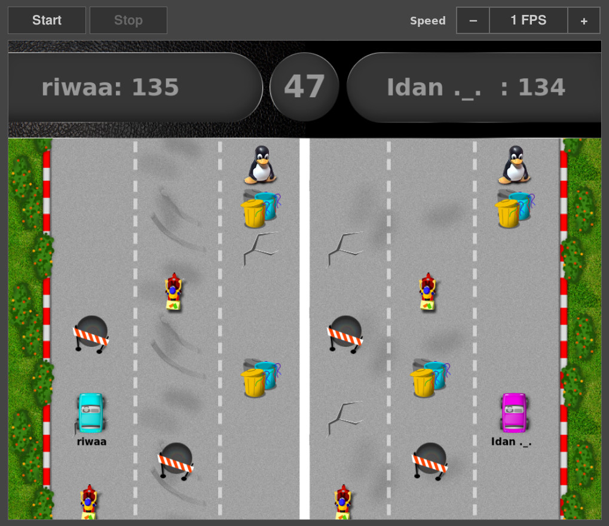

# ROSE Project

This project is a game that has been developed to assist in teaching kids python.
The students need to code the behavior of a car to achieve the best score.

Here is a video of a race (running code from students):
(Click on the screenshot to play the video)

In this game, two race cars compete to achieve the most points.
The race car must recognize the race track, the obstacles, and the bonus areas;
then calculate the best path where the pitfalls are avoided and all the bonus points are collected.
The cars move autonomously on the screen within the race track game with no interference
from the students. No joystick or mouse shall be used.

In order to control the car movements, the students needs to implement a 'driver'.
This code  controls the car and will decide what the next action of the car will be.

For each type of obstacles there is a different action and different points assigned.

See [examples/README.md](examples/README.md) for an explanation on how to write a driver module.

## GitHub pages

Refer to our GitHub pages for the course materials and additional resources:
[https://redhat-israel.github.io/ROSE/](https://redhat-israel.github.io/ROSE/)

## Talks and presentations

- [Read](http://www.pc.co.il/news/252820/) an interview with Miki Kenneth
  on [People and Computers](http://www.pc.co.il)
- [Read](http://schd.ws/hosted_files/osseu17/b9/BringingPeopleTogetherWithOpenSource.pdf)
  [Fred Rolland](https://github.com/rollandf) and [Ori Rabin](https://github.com/orrabin)'s presentation
  at [Open Source Summit Europe 2017](http://events.linuxfoundation.org/events/archive/2017/open-source-summit-europe-/)
- [Read](http://ap.hamakor.org.il/2017/tracks.html#main-f1015) [Fred Rolland](https://github.com/rollandf)
  and [Ori Rabin](https://github.com/orrabin)'s presentation at
  [August Penguin 2017](http://ap.hamakor.org.il/2017/)
- [Watch](https://www.youtube.com/watch?v=41oxZr43Ih0) [Fred Rolland](https://github.com/rollandf)
  and [Ori Rabin](https://github.com/orrabin)'s talk at
  [PyCon Israel 2017](http://il.pycon.org/2017/)
- [Read](https://opensource.com/education/15/9/open-source-education-israel) an article by Laura Novich
  on [opensource.com](https://opensource.com)

## Requirements

First we need to get pipenv installed. The best way is to install it for
your user:

    pip install --user pipenv

Now we can use pipenv to install the rest of the dependencies, and
create a virtual environment:

    pipenv install

You can also install packages from your distribution, but they may be
too old.

## Running the server

Open a pipenv shell that you'll use for the following commands:

    pipenv shell

Start the server on some machine:

    ./rose-server

Open a browser at http://\<server-address\>:8880 to view and control the game.

## Running a driver

Open a pipenv shell that you'll use for the following commands:

    pipenv shell

Start up the client, using your driver file:

    ./rose-client mydriver.py

The server address can be specified that way (Replace '10.20.30.44' with your server address):

    ./rose-client -s 10.20.30.44 mydriver.py

For driver modules, see the [examples](examples) directory.

You can run the game with just 1 driver!
To let 2 drivers compete, repeat these commands in 2 terminals.

Command line interface
----------------------

You can control the game from the command line using the rose-admin tool.

To start a race, use the rose-admin tool on any machine:

    ./rose-admin <server-address> start

To stop a race, use the rose-admin tool on any machine:

    ./rose-admin <server-address> stop

To modify the game rate, you can use the "set-rate" command. The following command
would change game rate to 10 frames per second:

    ./rose-admin <server-address> set-rate 10

## Creating a tarball

    python setup.py sdist

## Developing

Should you want to contribute to the project, please read the [Code of Conduct](docs/code-of-conduct.md).

To install development requirements:

    pipenv install --dev

To open a shell for development, use:

    pipenv shell

Before submitting patches, please run the tests:

    flake8
    pytest

Creating coverage report in html format:

    pytest --cov-report html
    xdg-open htmlcov/index.html
