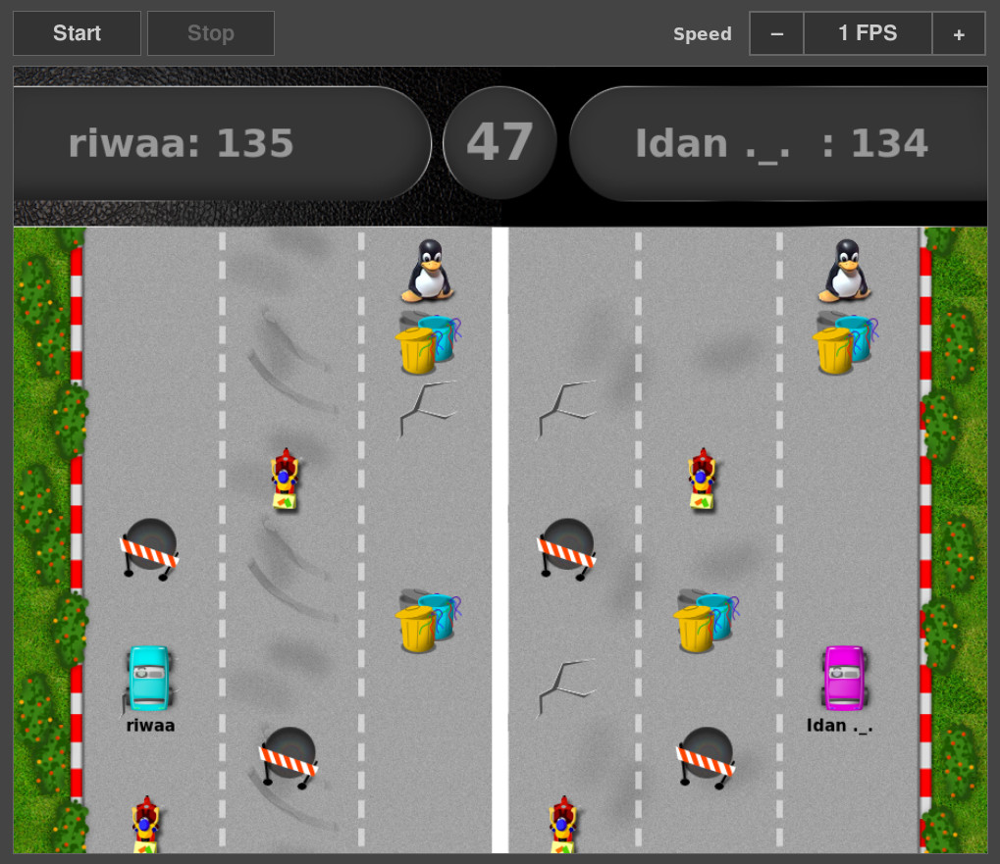

# ROSE Project

This project is a game that has been developed in order to help teach kids python.
The students are required to code the behavior of the car to achieve the best score.

Here is the link to the sample gameplay video of the race (running code from students):

In this game, two race cars compete to obtain the maximum number of points.
The race car must recognize the racing track, the obstacles on the way and the bonus areas;
calculate the best path to take to avoid any pitfalls; and collect as many bonus points as possible.
The cars move autonomously on their track, on screen, in the game without any interference or handling
from the students. No joystick or mouse needs to be used.
 
In order to control the movements of the car, the students needs to implement a 'driver'.
The code that implements 'driver' controls the car and will decide the next action/movement of the car.

For each type of obstacle, there is a different action that must be taken, and different points are alloted for the same.

See [examples/README](examples/README) for a thorough explanation on how to write a driver module.

## Requirements

To install the dependencies, run :

    pipenv install

For old users :

    pip install -r requirements.txt

You can also install packages from your distribution.

## Running the game

Start the server on some machine:

    ./rose-server

Open a browser at http://\<server-address\>:8880 to view and control the game.

Start up to 2 clients:

    ./rose-client mydriver.py

For driver modules, see the examples directory.

Command line interface
----------------------

You can control the game from the command line, using the rose-admin tool.

To start a race, use the following rose-admin tool command on any machine:

    ./rose-admin <server-address> start

To stop a race, use the following rose-admin tool command on any machine:

    ./rose-admin <server-address> stop

To modify the game rate, you can use the 'set-rate' command. The following command
will change the game rate to 10 frames per second:

    ./rose-admin <server-address> set-rate 10

## Creating a tarball

    python setup.py sdist

## Developing

Before submitting patches, please run the test :

    pytest

To create a coverage report in html format :

    pytest --cov-report html
    xdg-open htmlcov/index.html
