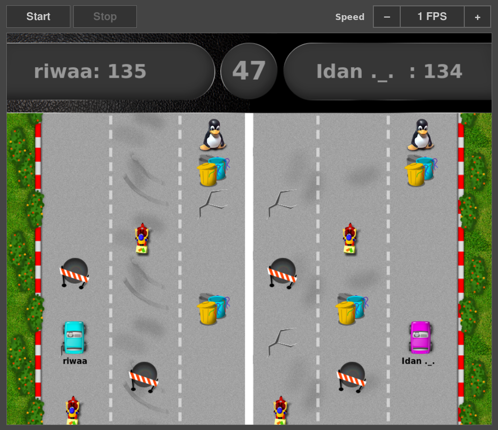

# ROSE Project

This project is a game that has been developed in order to help teaching kids python.
The students need to code the behavior of the car to achieve the best score.

Here is video of a race (running code from students):

In this game, two race cars compete to achieve the most points.
The race car have to recognize the race track, the obstacles, and the bonus areas;
calculate the best path to take to avoid the pitfalls; and collect bonus points.
The cars move autonomously on the screen within the race track game with no interference
from the students. No joystick or mouse would be used.
 
In order to control the car movements, the students needs to implement a 'driver'.
This code is controlling the car and will decide what will be the next action of the car.

For each type of obstacles there is a different action, and different points.

See [examples/README](examples/README) for explanation on how to write a driver module.

## Requirements

To install the dependencies, run:

    pipenv install

Or in the old-fashioned way

    pip install -r requirements.txt

You can also install packages from your distribution.

## Running the game

Start the server on some machine:

    ./rose-server

Open a browser at http://\<server-address\>:8880 to view and control the game.

Start up to 2 clients:

    ./rose-client mydriver.py

For driver modules, see the examples directory.

Command line interface
----------------------

You can control the game from the command line using the rose-admin tool.

To start a race, use rose-admin tool on any machine:

    ./rose-admin <server-address> start

To stop a race, use rose-admin tool on any machine:

    ./rose-admin <server-address> stop

To modify the game rate, you can use set-rate command. The following command
would change game rate to 10 frames per second:

    ./rose-admin <server-address> set-rate 10

## Creating a tarball

    python setup.py sdist

## Developing

Before submitting patches, please run the tests:

    pytest

Creating coverage report in html format:

    pytest --cov-report html
    xdg-open htmlcov/index.html
